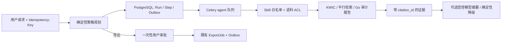

# 语料质检 / 检索 Agent Harness

## 目标与边界

该 Agent 是语料平台已有检索、并行语料审计和导出能力的受控编排层，不是拥有数据库、文件系统或 Shell 权限的聊天机器人。

它将每次请求固化为可恢复的 `AgentRun`、有限步骤 `AgentStep` 和（仅写操作）一次性 `AgentApproval`，以已经加工完成的语料索引和不可变审计报告作为事实来源。



模型只能摘要已授权、限长的证据，不能选择工具、绕过权限、直连业务数据库，也不能创建导出任务。

## 版本化 Skill

| Skill | 允许工具 | 写入边界 |
| --- | --- | --- |
| `corpus_retrieval@v1` | `search_kwic`、`search_parallel` | 只读 |
| `parallel_quality_review@v1` | `get_latest_quality_report`、`search_parallel` | 只读 |
| `corpus_export_handoff@v1` | 检索 + `prepare_export` | 只生成待确认载荷 |

`prepare_export` 不是写操作。只有同一发起用户在十分钟内请求 `approve` 后，后端才会复用既有 `create_export_job` 权限、配额、幂等和 Outbox 流程创建导出任务。

## API 契约

所有接口使用已有 Session 认证和工作空间 ACL。创建操作必须提供 `Idempotency-Key`；`X-Request-Id` 可选，缺失或非法时由服务端生成。

```text
POST /api/agent/runs/
GET  /api/agent/runs/
GET  /api/agent/runs/{run_id}/
POST /api/agent/runs/{run_id}/approve/
POST /api/agent/runs/{run_id}/cancel/
```

创建检索运行：

```json
{
  "corpus_id": "4b44617a-425c-4dcf-9b94-9aa4ac2dbb90",
  "mode": "retrieve",
  "query": "改革",
  "language": "zh",
  "max_results": 5
}
```

创建后立即返回持久化运行；客户端轮询详情接口获取状态。`evidence` 内每项均包含稳定 `citation_id`，KWIC 使用 `kwic:{row_id}`，平行语料使用 `parallel:{global_position}:{occurrence}`，审计报告使用 `audit:{audit_id}`。

## 故障恢复和安全属性

- 运行计划与 Outbox 事件在同一 PostgreSQL 事务中提交；Broker 或 Worker 故障不会丢失已接收请求。
- Run 有租约和状态转换，Celery 至少一次投递造成的重复消费不会重复执行已成功的步骤；恢复后从已持久化的步骤输出继续，而不是重新生成计划。
- 每次执行前均校验 Skill 白名单和 `visible_corpora_for(user)`；未授权语料、未注册工具和非法参数全部拒绝。
- 高风险导出由用户绑定的一次性审批保护；审批过期、取消、重复确认不会创建第二个导出。
- Trace 仅记录受控工具参数、摘要结果、状态与耗时；不记录模型密钥、原始 Prompt 或任意文件系统路径。
- 模型调用可选，默认关闭。上游超时、格式错误、未配置或引用越界时，返回包含同一批 citation 的确定性降级答案，模型不可用不会影响只读事实链路。

## 运行与评测

迁移和服务启动由现有 Compose 流程处理；Agent 任务已路由到 `agent` 队列，并由 `processing-worker` 消费。

```bash
cd backend
python manage.py migrate
python manage.py evaluate_corpus_agent --min-pass-rate 1.0
python manage.py test apps.agent.tests -v 2
```

`apps/agent/evaluation/cases.json` 是版本化的离线门禁，覆盖：单语/平行语料路由、质量审计约束、导出审批门禁、模型禁用时的引用保留。CI 要求通过率为 100%。新增 Skill 或工具时，必须同步增加工具边界与 Bad Case。

## 指标与告警

`/metrics` 新增：

```text
corpus_agent_runs{status="pending|running|waiting_approval|succeeded|failed|cancelled"}
```

生产告警覆盖失败运行和审批积压。排查时按 `request_id`、`run_id`、Outbox 事件和步骤 Trace 串联；不要通过重发 HTTP 请求恢复任务，应先确认运行状态，再按既有 Outbox 死信回放流程处理。

## 可选模型配置

默认 `AGENT_MODEL_ENABLED=false`。启用时使用 OpenAI-compatible `chat/completions` 网关，并配置：

```text
AGENT_MODEL_BASE_URL
AGENT_MODEL_API_KEY
AGENT_MODEL_NAME
AGENT_MODEL_TIMEOUT_SECONDS
AGENT_MODEL_MAX_OUTPUT_TOKENS
AGENT_MODEL_INPUT_USD_PER_1M
AGENT_MODEL_OUTPUT_USD_PER_1M
```

生产环境在启用模型时会校验前三项。成本按返回 token usage 计算并持久化到 `AgentRun`，用于后续预算与模型路由决策。
