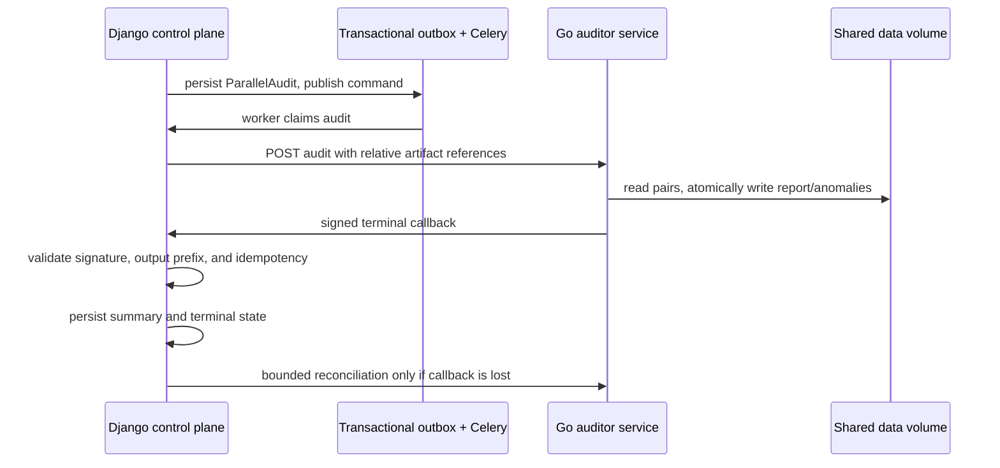

# Go corpus auditor service

## Boundary



The execution plane has no Django database credentials. The control plane
never executes the Go binary in production. Both services mount exactly the
same data root.

## Reliability behavior

| Failure | Behavior |
| --- | --- |
| Django cannot submit to Go | Celery retries; the Django audit is released back to `pending`. |
| Go process restarts during a job | Durable `running` job is requeued during service restore. |
| Go callback cannot reach Django | Go retries with bounded exponential backoff; Django periodically queries terminal remote state. |
| Duplicate submission/callback | Job ID + fingerprint is idempotent; Django stores the first terminal payload hash. |
| Output path escape | Both sides reject paths outside `processed/<corpus>/audits/<audit>/`. |
| Callback replay/tampering | HMAC signature plus five-minute timestamp skew validation rejects it. |

## Operations

Local Compose starts `corpus-auditor` separately and exposes HTTP `8090` and
gRPC `9090` only on the internal network. Production uses a durable
`auditor_state` volume and an explicit `DATA_ROOT_HOST_PATH` bind mount so the
Go service and Django workers see the same generated artifacts.

Useful checks:

```powershell
docker compose --env-file .env.local.example -f docker-compose.local.yml up --build
docker compose --env-file .env.local.example -f docker-compose.local.yml ps
```

`/metrics` exports `corpus_parallel_audits{status=...}`. Alert when remote
audits remain `running` beyond the expected workload window.
