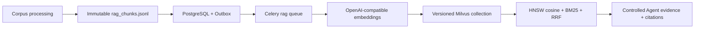

# Hybrid RAG retrieval data plane

## Scope

The platform now provides a grounded Hybrid RAG path in addition to the
existing exact KWIC and parallel-corpus retrieval paths. It is deliberately a
separate data plane: corpus processing owns canonical text chunks; RAG owns
only derived vectors and never becomes a new source of truth.



## Consistency contract

- `rag_chunks.jsonl` is emitted into the same staging directory and atomic
  directory swap as the processed corpus and SQLite lexical index.
- `RagIndex` is a durable control-plane manifest with a lease, attempt count,
  source processing task and terminal state.
- Processing writes the `rag.build_vector_index` Outbox event after the corpus
  reaches `ready`. An embedding provider outage retries independently and can
  never roll back lexical indexing.
- Each Milvus record stores only the chunk ID, language and SHA-256 of its
  canonical text. Query-time code verifies the chunk manifest checksum, record
  counts and each returned text hash before exposing context.
- Every rebuild targets a new collection derived from corpus ID, source manifest
  and embedding model. It is published in `rag_index.json` only after inserts,
  HNSW build and collection load succeed. Failed unpublished collections are
  deleted best-effort and can never replace a known-good manifest.

## Retrieval and Agent boundary

`POST /api/agent/runs/` accepts `mode: "rag"`. Its persisted plan has exactly
one allowed tool, `search_rag`; the model cannot select a tool or change
retrieval parameters. The tool retrieves candidate chunks through Milvus HNSW
cosine search with server-side language filtering, adds canonical BM25
candidates, fuses rankings through reciprocal-rank fusion, and returns bounded
evidence with `rag:<chunk_id>` citations.

The optional chat model may summarize only that evidence. It cannot invoke the
embedding provider, access files or database records directly, create exports,
or cite anything outside the retrieved IDs.

## Configuration and operations

Set the following in an untracked environment file before enabling indexing:

```text
RAG_INDEXING_ENABLED=true
RAG_EMBEDDING_BASE_URL=https://your-gateway.example/v1
RAG_EMBEDDING_API_KEY=...
RAG_EMBEDDING_MODEL=...
RAG_MILVUS_URI=http://milvus:19530
```

The endpoint must implement OpenAI-compatible `POST /embeddings` with ordered
`data[index].embedding` vectors. Compose runs Milvus Standalone and PyMilvus
creates a versioned collection with `chunk_id`, `text_sha256`, `language`, and
an HNSW/COSINE vector field. Tune `RAG_MILVUS_HNSW_M`,
`RAG_MILVUS_HNSW_EF_CONSTRUCTION`, and `RAG_MILVUS_HNSW_EF_SEARCH` only after
measuring recall and latency. The processing worker consumes the isolated `rag`
Celery queue. To build an index for an already processed corpus:

```bash
cd backend
python manage.py build_rag_index --corpus-id <corpus-uuid>
```

Agent RAG requests are rejected until the corresponding `RagIndex` is `ready`.
Inspect the RAG index in Django admin before replaying a dead-letter event; a
failed embedding request is independent of corpus processing and exports.
`/readyz` also checks Milvus whenever RAG indexing is enabled.

## Offline retrieval evaluation

Use a versioned JSON case file with human-validated citation IDs:

```json
[
  {
    "id": "approval-policy",
    "query": "which action needs explicit approval",
    "language": "en",
    "expected_citation_ids": ["rag:paragraph:<stable-id>:1"]
  }
]
```

Evaluate the index with deterministic retrieval metrics rather than asking the
same model to judge itself:

```bash
python manage.py evaluate_rag --corpus-id <corpus-uuid> --cases rag_cases.json \
  --top-k 5 --min-recall 0.8 --min-mrr 0.6
```

The command reports Recall@K, MRR, hit rate, p95 latency and the observed
citation IDs for every case. It exits non-zero when a configured quality gate
is missed, making the cases suitable for a release or regression workflow.
