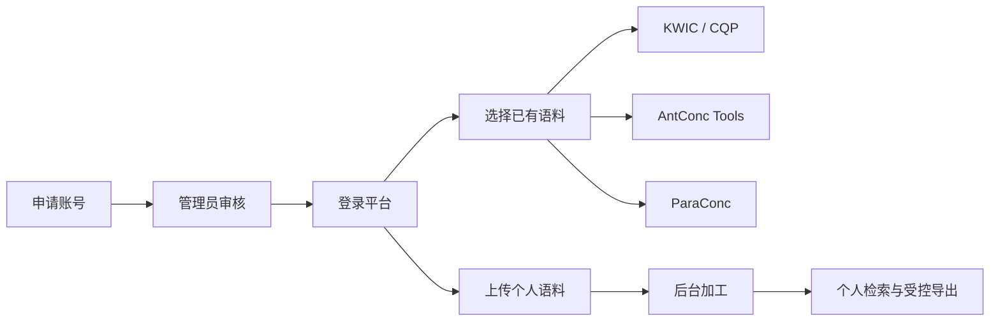

# 在线语料库平台使用说明书

> 文档版本：Stage 11
> 适用对象：语料库使用者、教师、平台管理员
> 默认本地地址：`http://localhost:8010/`

## 1. 平台简介

在线语料库平台用于中文、英文和中英平行语料的登记、加工、检索与统计分析。当前版本提供以下主要功能：

- 用户申请、管理员审核和分级访问；
- 教师语料、演示语料和用户私有语料管理；
- 中文、英文 KWIC 检索及 L/R 排序；
- CQPweb 风格安全查询子集；
- AntConc 风格词表、N-Gram、搭配、关键词、分布图和词云；
- ParaConc 风格中英双向平行检索；
- 用户 TXT 语料上传、后台加工、失败重试和安全删除；
- 用户私有语料的 Celery 后台 TSV 导出；
- 教师语料动态水印、数据库审计和上传安全扫描接口；
- 上传配额申请与管理员审批。

平台不会在检索时直接修改或扫描老师的原始文件。检索和统计读取加工后生成的只读索引。

## 2. 快速使用流程



普通用户最常用的操作顺序如下：

1. 申请账号并等待管理员审核。
2. 登录后打开“语料库”。
3. 选择状态为“可用”的语料库。
4. 使用 KWIC、AntConc Tools 或 ParaConc。
5. 如需分析自己的材料，进入“上传 TXT 语料”。
6. 等待后台加工完成后开始检索。
7. 本人私有语料可提交后台 TSV 导出。

## 3. 账号与权限

### 3.1 用户角色

| 角色 | 可访问范围 | 上传个人语料 | 查看教师语料 | 申请扩容 |
|---|---|---:|---:|---:|
| 测试用户 `test` | Demo 和本人私有语料 | 是，小额配额 | 否 | 否 |
| 初级用户 `junior` | Demo、初级教师语料、本人私有语料 | 是 | 初级 | 是 |
| 中级用户 `middle` | Demo、初级/中级教师语料、本人私有语料 | 是 | 初级和中级 | 是 |
| 高级用户 `advanced` | Demo、全部等级教师语料、本人私有语料 | 是 | 初级、中级和高级 | 是 |
| 管理员 `admin` | 全部语料和后台管理数据 | 是 | 全部 | 后台审批 |

用户无法查看其他用户的私有语料。无权限的私有语料通常表现为页面不存在，避免泄露其名称和元数据。

### 3.2 申请账号

打开：

```text
http://localhost:8010/accounts/apply/
```

填写以下信息：

- 用户名；
- 姓名；
- 单位；
- 邮箱；
- 申请等级；
- 使用目的；
- 申请理由；
- 密码及确认密码。

提交后，账号处于“待审核”状态。管理员审核通过前不能进入工作台。

### 3.3 登录与退出

登录地址：

```text
http://localhost:8010/accounts/login/
```

只有已审核且启用的账号可以登录。账号被拒绝、停用或尚未审核时，平台会拒绝访问受保护页面。

登录成功、登录失败和退出操作都会写入审计记录。登录失败记录不保存密码。

## 4. 页面导航

登录后，顶部导航包含以下入口：

- **语料库**：查看当前账号有权访问的全部语料，并从页面进入“我的语料”；
- **我的导出**：查看后台导出任务和下载结果；
- **工作台**：查看账号角色、审核状态和访问范围；
- **管理后台**：仅管理员可见；
- **退出**：结束当前登录会话。

## 5. 语料库与 Documentation

### 5.1 语料来源

平台语料分为三类：

| 来源 | 说明 | 是否可批量导出 |
|---|---|---:|
| 教师语料 | 按用户等级授权，页面带动态水印 | 否 |
| 演示语料 | 用于教学演示和功能体验 | 否 |
| 用户自建语料 | 仅所有者和管理员可见 | 是 |

### 5.2 语料状态

| 状态 | 含义 | 用户操作 |
|---|---|---|
| 已登记 `created` | 只有元数据或尚未进入加工 | 等待添加文件或加工 |
| 等待加工 `pending_processing` | 已进入后台队列 | 等待 |
| 加工中 `processing` | Celery 正在生成标准文件和索引 | 查看进度 |
| 可用 `ready` | 加工成功 | 可使用检索和统计工具 |
| 失败 `failed` | 文件结构或加工过程有错误 | 查看错误并重试 |
| 已停用 `disabled` | 管理员已停用 | 普通用户不可使用 |

### 5.3 Corpus Documentation

在语料库列表中点击“Documentation”，可以查看：

- 语料来源、类型和语言；
- 访问等级；
- 当前状态和加工阶段；
- 文件、文档、段落、句子数量；
- Token 和 Type 数量；
- 平行语料的人工对齐预览；
- 最新后台任务状态、进度和错误信息。

状态为“可用”时，页面会出现 KWIC、AntConc Tools，以及平行语料的 ParaConc 入口。

### 5.4 教师语料水印

教师语料页面会显示重复动态水印，内容包含：

- 当前用户名；
- 当前分钟时间；
- 签名追踪码。

水印用于授权追踪，不应通过截图裁剪、样式修改等方式规避。Demo 和个人私有语料不显示教师水印。

### 5.5 登记个人语料元数据

已审核的普通用户可在语料库列表点击“登记元数据”，填写语料名称、类型、语言和说明。该操作只创建一个私有语料条目，不上传文件，也不会自动启动加工。

只有元数据的条目不能直接检索。一般用户如需立即分析自己的材料，应使用“上传 TXT 语料”；元数据登记主要用于提前建立记录，之后由管理员补充文件和启动加工。测试账号不能使用元数据登记功能。

## 6. 上传个人语料

### 6.1 上传入口

点击“语料库”右上角的“上传 TXT 语料”，或打开：

```text
http://localhost:8010/corpora/upload/
```

上传语料只对本人和管理员可见。普通用户默认单文件上限和账号总额均为 30 MB；测试账号默认单文件 2 MB、账号总额 5 MB。实际限制以页面显示为准，管理员可以调整。

### 6.2 支持的上传模式

#### 模式一：单语原始 TXT

适用于纯中文或纯英文文本。

需要填写：

- 语料库名称；
- 语料类型选择“单语原始 TXT”；
- 文本语言；
- 一个 `.txt` 文件；
- 可选说明。

加工成功后可使用 KWIC、CQP 和全部 AntConc Tools。

#### 模式二：中英段落人工对齐 TXT

需要同时上传一个中文 TXT 和一个英文 TXT。两个文件必须已经按空行分成数量相同、顺序对应的段落。

示意：

```text
中文文件第 1 段  <->  英文文件第 1 段
中文文件第 2 段  <->  英文文件第 2 段
```

平台保留人工段落顺序，不自动猜测、移动或重新对齐译文。段落数不一致时加工失败。

加工成功后可使用 KWIC、AntConc Tools 和 ParaConc。ParaConc 的主要对齐单位为段落。

#### 模式三：中英编号/POS 人工对齐 TXT

适用于已经带有段落号、句号和词性标注的中英双语文件。两侧必须具有一致的 `<p n="...">` 和 `<s n="...">` 编号。

示意：

```xml
<p n="1">
  <s n="1">中国/ns 发展/v 迅速/a</s>
</p>
```

英文词性可使用类似 `development_NN1` 的标记。标签和 POS 不会作为正文显示，但会保留到 Token 索引供 POS/CQP 查询使用。

两侧编号不一致时加工失败。加工成功后支持句子和段落两种 ParaConc 对齐视图。

### 6.3 文件要求

- 文件扩展名必须为 `.txt`；
- 文件不能为空；
- 建议使用 UTF-8 编码；
- 文件内容必须为可解码的纯文本；
- 不要把 Word、PDF、压缩包或可执行文件改名为 `.txt` 上传；
- 上传内容应拥有合法的教学、研究和处理权限；
- 正式环境会在最终落盘前调用恶意文件扫描器。

系统使用随机文件名保存上传内容，不直接使用用户提供的磁盘文件名。

### 6.4 加工与进度

点击“上传并进入后台加工”后：

1. 平台验证扩展名、大小、总配额和文本内容；
2. 安全扫描通过后保存到个人私有目录；
3. 创建 Celery 加工任务；
4. 生成标准结构文件和检索索引；
5. 成功后语料状态变为“可用”。

Documentation 页面会自动刷新加工进度。同一账号同时只能有一个活动加工任务。

### 6.5 加工失败、重试与删除

加工失败时，Documentation 页面会显示错误原因。常见原因包括：

- 文件不是有效纯文本；
- 中英段落数量不一致；
- 两侧 `<p>` 或 `<s>` 编号不一致；
- 源文件缺失；
- 后台服务或安全扫描服务暂时不可用。

如源文件仍存在，可以点击“重试加工”。

点击“删除个人语料”会永久删除：

- 数据库中的个人语料记录；
- 上传文件；
- 加工结果；
- 检索索引；
- 对应导出文件。

删除操作不可撤销。任务正在等待或运行时不能删除。

### 6.6 申请扩容

进入“我的语料”，点击“申请扩容”。填写：

- 申请单文件上限，单位 MB；
- 申请账号总额，单位 MB；
- 扩容理由。

申请总额必须高于当前总额，且单文件上限不能超过总额。每个用户同时只能有一个待审核申请。测试账号不能申请扩容。

管理员批准后新配额立即生效。

## 7. KWIC 检索

### 7.1 打开 KWIC

在状态为“可用”的语料库右侧点击“KWIC”，或从 Documentation 页面进入。

### 7.2 普通 KWIC

普通模式支持：

- 中文词：`数字经济`
- 英文词：`development`
- 同一句内的连续短语：`high quality`

主要参数：

| 参数 | 说明 |
|---|---|
| 查询语法 | 普通 KWIC 或 CQP 子集 |
| 语言 | 中文或英文；双语语料需要明确选择 |
| 首词 POS | 按命中首词词性过滤，如 `n`、`NN1` |
| 左右窗口 | 显示命中词左右各多少个 Token，范围 0–50 |
| 排序位置 | 语料顺序，或按 L1/L2/L3/R1/R2/R3 排序 |
| 每页条数 | 1–100，默认 50 |

上下文限制在当前句子内，不跨句拼接。

### 7.3 结果说明

每条 KWIC 结果包含：

- 左文；
- 命中词或短语；
- 右文；
- L3、L2、L1、R1、R2、R3 排序词；
- 来源文件；
- 段落序号和句子序号。

L/R 排序先作用于全部命中，再执行分页。英文排序忽略大小写，缺失上下文排在最后，相同排序键保持语料原始顺序。

### 7.4 POS 快捷过滤

“首词 POS”只过滤命中表达式的第一个词。例如：

```text
查询词：development
首词 POS：NN1
```

POS 过滤最适合带人工词性标注的语料。未标注语料可能没有可用 POS。

## 8. CQP 安全查询子集

在 KWIC 页面把“查询语法”切换为“CQP 子集”。当前平台只支持经过白名单限制的安全子集，不等同于完整 CQPweb。

### 8.1 支持的表达式

| 用途 | 示例 |
|---|---|
| 精确词 | `development` |
| 精确短语 | `"high quality"` |
| 多字符通配符 | `develop*` |
| 单字符通配符 | `?ocus` |
| 前缀函数 | `starts_with(develop)` |
| 后缀函数 | `ends_with(ment)` |
| 包含函数 | `contains(velo)` |
| word 属性 | `[word="development"]` |
| POS 属性 | `[pos="NN1"]` |
| lemma 属性 | `[lemma="develop"]` |
| 连续条件 | `[pos="AT0"] [pos="NN1"]` |

空格连接的属性条件必须在同一句内连续出现。

### 8.2 使用注意

- 选择的语言必须与表达式语言一致；
- 不能使用未知属性；
- 不能提交未闭合引号；
- 纯通配符等无限制表达式会被拒绝；
- 不支持任意 SQL、任意正则或完整 CQPweb 语法；
- 查询值使用参数化过滤，不会作为 SQL 代码执行。

出现语法错误时，页面会显示中文提示，不会执行查询。

## 9. AntConc Tools

从语料库列表或 Documentation 点击“AntConc Tools”。页面顶部包含六个分析标签。

### 9.1 Word List

用于生成词频表。

可设置：

- 语言；
- 词项包含过滤；
- POS；
- 是否包含标点；
- 按 Frequency 或 Word 排序；
- 每页条数。

结果字段：

- **Rank**：当前排序下的排名；
- **Word**：词项，点击后进入 KWIC；
- **Frequency**：语料中的实际频次；
- **Per million**：每百万 Token 标准化频次。

### 9.2 N-Gram / Clusters

用于查找连续出现的词组。

支持 2–5 gram，可设置最小频次、文本过滤、标点和分页。点击 Cluster 可以进入 KWIC 核查原始语境。

N-Gram 不跨句生成。

### 9.3 Collocates

用于计算中心词左右窗口内的搭配词。

可设置：

- Search term；
- 中文或英文；
- Left span 和 Right span，范围分别为 0–10；
- 最小共现次数；
- 搭配词 POS；
- 是否包含标点；
- LogDice、MI、T-score、Frequency 或 Word 排序。

左右窗口不能同时为 0。结果同时显示共现频次、全语料频次、MI、T-score 和 LogDice。统计值用于排序和比较，建议结合频次及 KWIC 语境解释。

### 9.4 Keywords

用于比较目标语料和参照语料的词项差异。

操作步骤：

1. 当前语料自动作为目标语料；
2. 选择一个有权限访问的参照语料；
3. 选择双方都包含的语言；
4. 设置最小频次、最小文档数和过滤条件；
5. 选择是否显示负关键词；
6. 按 Log-Likelihood、Chi-square、Log Ratio、Frequency 或 Word 排序。

平台只允许语言和分词口径兼容的比较组合。私有参照语料不会向其他用户泄露。

结果中的正方向表示目标语料相对突出，负方向表示参照语料相对突出。点击关键词可进入目标语料 KWIC。

### 9.5 Concordance Plot

输入检索词和语言后，平台把每个文档归一化为 100 个位置槽，显示命中在文档中的分布。

该工具适合观察词项集中在文档开头、中部、结尾，还是均匀分布。不同长度文档已归一化，但图形不表示绝对字数位置。

### 9.6 Wordcloud

可设置：

- 语言；
- 最小频次；
- 最大显示词数：25、50、100 或 200；
- 深海蓝、森林绿或落日橙主题；
- 自定义停用词；
- 是否包含标点。

停用词可以用空格、逗号、分号或换行分隔，最多 200 个。词项大小采用对数频次缩放。悬停可查看频次，点击词项进入 KWIC。

## 10. ParaConc 平行检索

ParaConc 只出现在中英平行语料中。

### 10.1 基本检索

填写主检索词，并选择：

- 中文 → 英文；
- 英文 → 中文；
- 句子或段落对齐单位；
- 每页 20、50 或 100 条。

页面同时显示中文原文和英文译文，并高亮命中内容。结果保持人工对齐顺序。

当主检索词只填写在一侧时，平台会利用当前平行语料中的重复对齐证据推断另一侧可能的对应译词。例如中文检索“农民”时，可自动高亮英文 `peasant/peasants`。页面会把此类结果明确标记为“自动译词高亮（语料内共现推断）”。

自动高亮只是阅读辅助，不等同于人工词对齐或翻译结论。只有重复证据和区分度达到阈值时才会启用；证据不足时不做猜测。如需指定目标词，应展开“双语 AND / NOT 条件”并填写目标侧“同时包含”，显式条件优先于自动推断。

只有索引中实际存在的对齐单位才可选择。普通成对原文通常以段落为权威对齐，编号/POS 语料可以提供句子和段落视图。

### 10.2 双语 AND / NOT

展开“双语 AND / NOT 条件”后，可以填写：

- 中文同时包含；
- 英文同时包含；
- 中文排除；
- 英文排除。

示例：

```text
主检索词：经济
检索方向：中文 → 英文
英文同时包含：development
英文排除：decline
```

至少填写一个主检索词或“同时包含”条件。排除条件不能单独构成检索。

### 10.3 结果字段

每组结果显示：

- Pair 序号；
- 全局位置；
- 中文原文；
- 英文译文；
- 对齐单位；
- 对齐方法；
- 置信度。

“provided”表示沿用源文件提供的人工对齐，不代表平台重新计算了译文关系。

## 11. 后台导出

### 11.1 可导出范围

只有满足以下条件的语料可以批量导出：

- 来源为用户自建语料；
- 当前用户是语料所有者；
- 语料状态为“可用”。

教师语料和 Demo 语料只能在线分页查看，KWIC 和 ParaConc 批量导出均被后端拒绝。

### 11.2 创建导出任务

1. 在本人私有语料中执行 KWIC 或 ParaConc 检索。
2. 确认检索条件和结果。
3. 点击“后台导出 TSV”。
4. 平台将当前检索条件规范化并提交给 Celery。
5. 跳转到“我的导出”查看进度。

导出不是当前页面截图，而是对当前检索条件的完整受控结果集执行后台计算。

### 11.3 导出状态

| 状态 | 说明 |
|---|---|
| 等待执行 | 已进入队列 |
| 执行中 | 正在生成 TSV |
| 可下载 | 文件生成成功 |
| 失败 | 查询、索引、存储或后台任务失败 |
| 已过期 | 文件已撤销并清理 |

“我的导出”页面在存在活动任务时每 3 秒自动刷新。

### 11.4 默认限制

以下为当前默认值，部署时可由管理员调整：

- 每个用户同时最多一个活动导出任务；
- 每小时最多创建 10 个导出任务；
- 每个导出最多 100,000 行；
- 文件默认有效期 24 小时；
- 每个文件默认最多下载 5 次。

下载时平台会重新校验所有者、任务状态、有效期、下载次数、文件存在性和安全路径。

### 11.5 TSV 文件

导出文件使用 UTF-8 BOM 编码，可用支持 UTF-8 的表格软件打开。平台会清理单元格换行和 NUL，并防止以 `= + - @` 开头的内容被表格软件解释为公式。

## 12. 审计与数据保护

平台会记录以下事件：

- 登录成功、登录失败和退出；
- KWIC、CQP、ParaConc 和 AntConc 查询；
- 上传、重试和删除个人语料；
- 扩容申请及管理员审批；
- 导出创建、完成、失败和下载；
- Django 管理后台操作。

审计记录包含必要的用户、语料、时间、请求路径和受限查询参数，不保存登录密码。审计记录在管理后台只读。

用户应遵守以下规则：

- 不传播教师语料全文或绕过导出限制；
- 不共享个人账号；
- 不上传无权处理的材料；
- 不在文件名、语料名称或查询中放入密码、密钥等敏感信息；
- 下载个人导出后自行承担本地文件保管责任；
- 完成研究后及时删除不再使用的个人语料和导出。

## 13. 管理员操作

管理后台地址：

```text
http://localhost:8010/admin/
```

### 13.1 审核用户

进入“用户申请与权限”：

1. 打开待审核记录；
2. 核对姓名、单位、邮箱、申请等级、用途和理由；
3. 设置最终角色；
4. 使用“审核通过所选申请”或“拒绝所选申请”；
5. 如需停用账号，使用“停用所选账号”。

审核通过后用户可以登录。拒绝或停用会使账号不可用。

### 13.2 审核扩容申请

进入“上传配额申请”：

1. 核对申请人、单文件额度、总额度和理由；
2. 选择待审核申请；
3. 使用“批准所选扩容申请”或“拒绝所选扩容申请”。

申请内容在后台只读，管理员不能静默修改用户提交的数据。批准后额度写入用户资料。

### 13.3 语料库管理

管理员可以在后台查看和维护：

- 语料库来源、类型、语言和访问等级；
- 所有者；
- 状态和阶段；
- 文件元数据；
- Corpus Documentation；
- 后台加工任务。

教师语料应设置为 `teacher`，并根据授权范围选择 `junior`、`middle` 或 `advanced`。不要把受版权保护的教师语料设置为 Demo。

### 13.4 审计和导出任务

- “审计事件”为只读数据；
- “导出任务”为只读数据；
- 管理员可按事件类型、时间、用户名、语料和路径检索审计记录；
- 不要直接在数据库中把失败导出修改为成功。

### 13.5 定期清理过期导出

建议至少每小时执行一次：

```powershell
cd D:\Desktop\CONC\corpus-platform\backend
.\.venv\Scripts\python.exe manage.py expire_exports
```

该命令会把到期任务标记为已过期，并删除受控导出目录内的结果文件。

## 14. 本地启动与停止

### 14.1 使用 Docker 启动

在项目根目录执行：

```powershell
cd D:\Desktop\CONC\corpus-platform
docker compose -f docker-compose.local.yml up -d db redis
docker compose -f docker-compose.local.yml build web worker
docker compose -f docker-compose.local.yml run --rm web python manage.py migrate
docker compose -f docker-compose.local.yml up -d web worker
```

打开：

```text
http://localhost:8010/
```

停止平台：

```powershell
docker compose -f docker-compose.local.yml down
```

### 14.2 使用本地 Python 启动

先保证 PostgreSQL 和 Redis 已运行，然后在 `backend` 目录分别启动 Django 和 Celery。

Django：

```powershell
cd D:\Desktop\CONC\corpus-platform\backend
.\.venv\Scripts\python.exe manage.py migrate
.\.venv\Scripts\python.exe manage.py runserver 127.0.0.1:8010
```

Celery：

```powershell
cd D:\Desktop\CONC\corpus-platform\backend
.\.venv\Scripts\celery.exe -A config worker --loglevel=info --pool=solo
```

Windows 本地开发建议使用 `--pool=solo`。

### 14.3 健康检查

| 地址 | 用途 |
|---|---|
| `/healthz` | 检查 Django 进程是否存活 |
| `/readyz` | 检查数据库、Redis 和数据目录是否就绪；Celery 需另查 worker 日志 |

## 15. 常见问题

### 15.1 登录后仍无法进入语料库

检查账号是否已审核、是否被停用，以及登录账号是否具有有效用户资料。联系管理员核对角色和状态。

### 15.2 看不到某个教师语料

教师语料按等级过滤。初级用户看不到中级和高级语料，中级用户看不到高级语料，测试用户看不到任何教师语料。

### 15.3 上传提示文件过大或总额不足

进入“我的语料”查看当前使用量和配额。删除不再需要的个人语料，或提交扩容申请。

### 15.4 上传后一直停留在“等待加工”

通常表示 Celery worker 未运行或 Redis 不可用。管理员应检查 `/readyz`、Celery 日志和 Redis 连接。

### 15.5 双语语料加工失败

段落对齐模式应检查两侧非空段落数量和顺序；编号/POS 模式应检查两侧 `<p n>`、`<s n>` 编号是否完全对应。

### 15.6 KWIC 提示索引不可用或损坏

平台不会回退扫描原始文件。管理员应检查加工任务和 `data/indexes/<corpus_id>/`，必要时重新加工语料。

### 15.7 CQP 查询被拒绝

检查引号、属性名、语言和通配符。当前只支持本说明书列出的安全子集。

### 15.8 Keyword 没有可选参照语料

只有当前账号有权访问、状态可用、包含所选语言且分词口径兼容的语料才能作为参照语料。

### 15.9 ParaConc 没有句子对齐选项

该语料可能只提供人工段落对齐。平台不会自动把段落重新推断为句对。

### 15.10 没有“后台导出 TSV”按钮

教师语料和 Demo 语料禁止批量导出。只有本人状态为“可用”的私有语料显示该按钮。

### 15.11 导出任务失败

检查查询条件、索引状态、Celery、Redis、磁盘空间和结果行数。失败信息会显示在“我的导出”中。

### 15.12 导出文件无法下载

文件可能已过期、达到下载次数上限、被清理或不属于当前账号。请重新提交导出任务。

### 15.13 页面出现 403、404 或 409

| 状态码 | 常见含义 |
|---|---|
| 403 | 当前账号没有权限执行操作 |
| 404 | 资源不存在，或私有资源对当前账号不可见 |
| 409 | 导出尚未完成、已过期或文件状态冲突 |

## 16. 使用建议

- 上传前先统一编码、段落和句子编号；
- 先用 Word List 了解词频，再进入 KWIC 核查语境；
- 搭配和关键词结果应同时参考频次、统计值和具体语境；
- 平行检索优先尊重人工对齐，不把置信度当成翻译质量评分；
- 导出前先用页面查询缩小范围，避免生成无必要的大文件；
- 教师语料只用于授权范围内的在线教学和研究；
- 研究结论应记录语料名称、查询条件、语言、对齐单位和统计参数，保证可复核。

## 17. 当前版本边界

当前平台已完成 Stage 0–11。以下内容属于后续 Stage 12 发布工作，不应视为当前代码已经完成：

- 正式域名和 HTTPS 证书部署；
- 反向代理和生产流量治理；
- 自动备份及恢复演练；
- 监控、告警和容量看板；
- 高并发压测和正式发布门禁。

在正式对外发布前，管理员还需配置生产 PostgreSQL、Redis、Celery、持久化存储和可用的 ClamAV 扫描服务。
